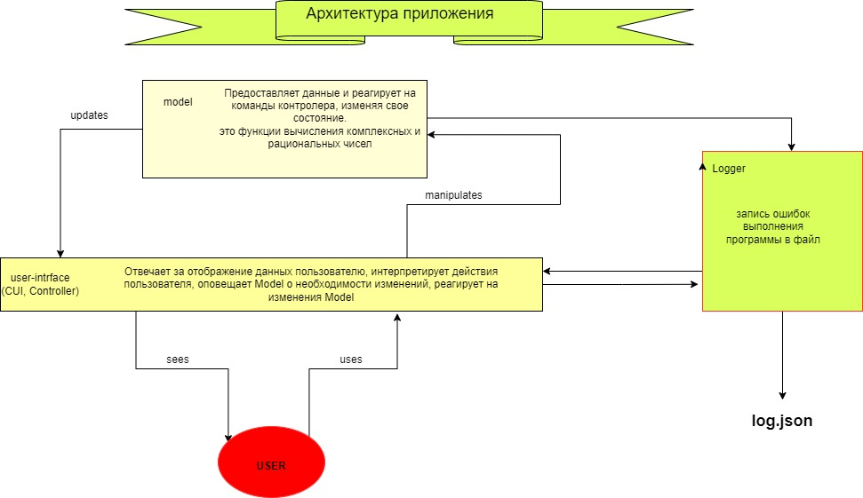
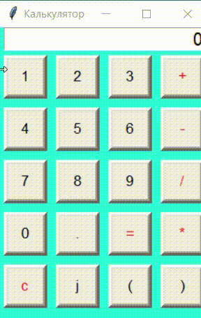
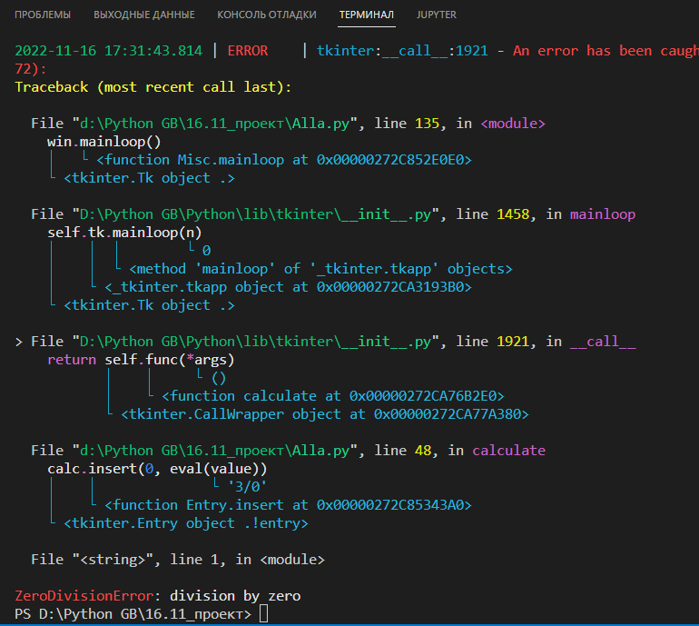

# Калькулятор

Предназначен для выполнения несложных вычислительных операций: сложения, вычитания, умножения и деления. В калькуляторе предусмотрена возможность работы с комплексными и рациональными числами. Есть возможность группировки операций (кнопки со скобками). При вычислении определяет приоритет операций:

     1+1*2= дает в результате 3 

## Архитектура программы  




## Интерфейс программы 

Интерфейс спроектирован таким образом, чтобы имитировать внешний вид реального калькулятора. Его «кнопки» можно нажимать мышкой. Возможен ввод с цифровой клавиатуры. Через них пользователь взаимодействует с программой и управляет ею.



**Графический интерфейс пользователя (GUI)** выполнен с использованием пакета `tkinter`, который работает с библиотекой `Tk`.

Этапы разработки интерфейса следующие:

1. Импорт библиотеки
2. Создание главного окна
3. Создание виджетов
4. Установка их свойств
5. Определение событий
6. Определение обработчиков событий
7. Расположение виджетов на главном экране
8. Отображение главного экрана

### Подключение библиотеки 

```python
import tkinter as tk
```
### Создание главного окна

Объект окна верхнего уровня создается при обращении к классу `Tk` модуля `tkinter`. Переменную связанную с объектом-окном назовем `win`.

```python
win = tk.Tk()   # создаем переменную
win.geometry(f"240x335+100+200") # начальные размеры окна
win['bg'] = '#33ffe6'  # цвет заливки фона
win.title('Калькулятор') # заголовок окна
```

### Работа с виджетами

В библиотеке `tkinter` существует много виджетов. Для создания интерфейса были задействованы виджеты "Button" (кнопка) и "Entry" (поле ввода).

У кнопки есть много свойств: надпись, цвет фона, размер. Кнопка принимает событие нажатия на кнопку, алгоритм оформлен ввиде функции. 

К примеру расмотрим функцию `def make_digit_button`, которая принимает в качестве аргумента цифру, которая пишется на этой кнопке и возвращает созданную кнопку, при помощи метода `.grid` размещаем кнопку на экране. Задаем кнопке команду  используя lambda функцию, будет выполняться функция добавления цифры `def add_digit`

```python
def add_digit(digit):
    value = calc.get()    
    if  value[0]=='0' and len(value)==1:     
        value = value[1:]    
    calc.delete(0,tk.END)
    calc.insert(0,value+digit)

def make_digit_button(digit):
    return tk.Button(text=digit, bd=5, font=('Arial',13), command=lambda : add_digit(digit))

make_digit_button('1').grid(row=1, column=0, stick='wens',padx=5, pady=5)
```
Аналогичным образо созданы кнопки, которые добавляют операции и символы '`=`', '`+`', '`-`', '`*`', '`/`', '`c`', '`.`', '`(`', '`)`'.

В программе выполнена обработка нажатия кнопок на клавиатуре, для этого использован метод `.bind`. Методу мы передаем параметром событие нажатия кнопки на клавиатуре, вызываем функцию `press_key`. Функция принимает аргумент (`event`) и распечатывает его. Имея доступ к элементу, обработаны нужные нам события:

```python
def press_key(event):
    print(repr(event.char))
    if event.char.isdigit():
        add_digit(event.char)
    elif event.char in '+-*/':
        add_operation(event.char)
    elif event.char =='\r':          
        calculate()
    elif event.char =='j':          
        add_complex_char(event.char) 
    elif event.char =='.':          
        add_point_char(event.char) 
    elif event.char =='(':          
        add_bracket_char(event.char)
    elif event.char ==')':          
        add_bracket_char(event.char) 

 win.bind('<Key>', press_key)                
```

Реализация кнопки '`=`': определена функцией `def calculate()`, которая вызывается при нажатии кнопки

```python
def calculate():
    value = calc.get()       # функция принимает значение value (это строка, состоящяя из введенных пользователем цифр и операций)
    if value[-1] in '+-/*':  
        value = value + value[:-1]  
    calc.delete(0,tk.END)       # очищаем поле ввода
    calc.insert(0, eval(value))     # вставляем значение, которое вычисляем в модуле вычисления (показан пример при помощи функции eval)

def make_calc_button(operation):
    return tk.Button(text=operation, bd=5, font=('Arial',13), fg='red',
                    command=calculate)    
```

Реализация кнопки '`c`': определена функцией `def clear()`, которая вызывается при нажатии кнопки: 

```python
def clear():
    calc.delete(0,tk.END)  
    calc.insert(0,0)

def make_clear_button(operation):
    return tk.Button(text=operation, bd=5, font=('Arial',13), fg='red',
                    command=clear)    
```

Чтобы пользователь мог взаимодействовать с программой, в конце добавляем:

```python
win.mainloop()
```
Функция `mainloop()` вызывает бесконечный цикл. Окно будет ждать любого действия от пользователя до тех пор, пока пользователь его не закроет (пока не запустит `exit()`). Без mainloop() окно не отобразится.


## Модуль логирования

Модуль логирования выполнен с использованием встроенной в *`Python`* библиотеки `loguru`. 
Установка библиотеки: `pip install loguru`
Сконфигурировала библиотеку для работы: определила формат записи лога в файл с расширением .json. Установала уровень лога `'DEBUG'`
```python
from loguru import logger

logger.add('debug.json', format='{time} {level} {message}', level='DEBUG', serialize=True) 
```
Использовала встроенный в библиотеку декоратор `@logger.catch `, который отлавливает все `exeption` и отправляет их в консоль терминала и файл, заданного формата.

Ниже пример обработки ошибки деления на ноль (ZeroDivisionError):




## Модуль Model 

В модуле находятся функции вычисления. (в разработке, использована пока функция еval)
